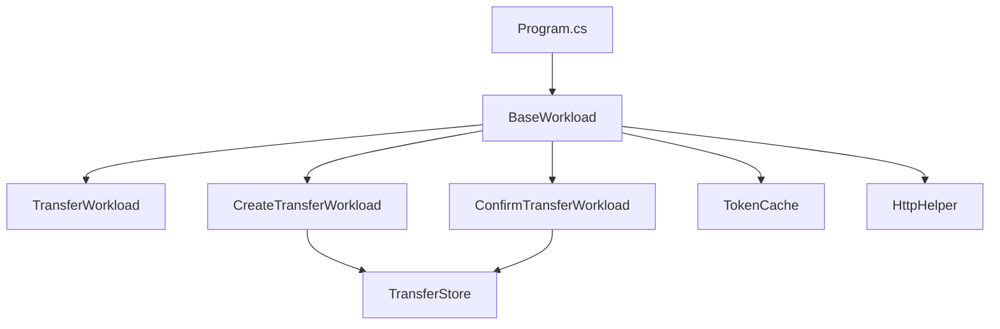

# Old CashlessLoadTest.Worker - Documentation

## Overview
مشروع اختبار الحمل (Load Testing) لنظام Cashless باستخدام **DFrame**.
يختبر عمليات **تحويل الأموال** بين المستخدمين.

---

## Architecture



---

## Files Structure

| File | Purpose |
|------|---------|
| [Config.cs](file:///d:/programms/Load-Testing/old/CashlessLoadTest.Worker/Config.cs) | إعدادات عامة + قائمة المستخدمين |
| [Program.cs](file:///d:/programms/Load-Testing/old/CashlessLoadTest.Worker/Program.cs) | Entry point + CLI parsing |
| [BaseWorkload.cs](file:///d:/programms/Load-Testing/old/CashlessLoadTest.Worker/BaseWorkload.cs) | Base class + Login + Token management |
| [Models.cs](file:///d:/programms/Load-Testing/old/CashlessLoadTest.Worker/Models.cs) | Request/Response DTOs |
| [HttpHelper.cs](file:///d:/programms/Load-Testing/old/CashlessLoadTest.Worker/HttpHelper.cs) | HTTP requests with retry |
| [TokenCache.cs](file:///d:/programms/Load-Testing/old/CashlessLoadTest.Worker/TokenCache.cs) | File-based token caching |
| [TransferStore.cs](file:///d:/programms/Load-Testing/old/CashlessLoadTest.Worker/TransferStore.cs) | File-based transfer ID storage |

---

## Workloads (السيناريوهات)

### 1. TransferWorkload
**Create + Confirm** في نفس الـ Execute.
- يسجل دخول → ينشئ تحويل → يؤكد التحويل

### 2. CreateTransferWorkload  
**Create فقط** - يحفظ الـ TransferId في `TransferStore`.

### 3. ConfirmTransferWorkload
**Confirm فقط** - يقرأ TransferId من `TransferStore` ويؤكده.

---

## Config.cs - الإعدادات

```csharp
BaseUrl = "https://mada.com:2401"
CommonPin = "654321"
Users = ["776134932", "777462906", ...] // 42 مستخدم
```

**ENV Variables:**
- `BASE_URL`, `HTTP_TIMEOUT_SECONDS`, `MAX_RETRIES`
- `LOGIN_MAX_RETRIES`, `LOGIN_RETRY_DELAY_MS`
- `TOKEN_CACHE_DIRECTORY`, `TRANSFER_STORE_DIRECTORY`

---

## BaseWorkload - Token Management

```csharp
EnsureValidTokenAsync() {
    1. Check cached token (file-based)
    2. If expired → LoginAsync()
    3. Save new token to cache
}

LoginAsync() {
    POST /auth/connect/token
    - grant_type: pin_code_credentials
    - phone_number, pin_code
    - Retry on 409 Conflict
}
```

---

## Usage

```powershell
.\CashlessLoadTest.Worker.exe http://192.168.10.14:7313 --vp 10 --url https://mada.com:2401
```

**CLI Options:**
- `--url`, `--base-url` - API Base URL
- `--vp`, `--virtual-process` - عدد الـ VUs

---

## Key Differences from New Version

| Feature | Old | New (cashless-loadtest) |
|---------|-----|-------------------------|
| Scenario | Transfer (Create+Confirm) | SignupActors (Register+Verify) |
| Auth | PIN code login | OAuth + HMAC signature |
| Users | Hardcoded 42 users | Generated dynamically |
| Node ID | None | `--node-id` for uniqueness |
| Config | Postman files | Postman files |
